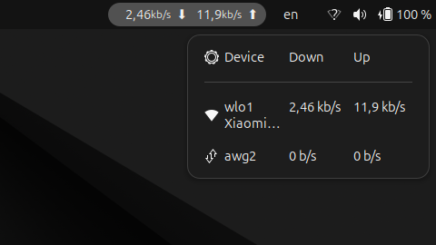

# NetPulse

A GNOME Shell extension that displays real-time network upload and download speed in the top panel.

Compatible with **GNOME 45, 46, 47** (Ubuntu 24.04+).



---

## Features

- Live upload ⬆ and download ⬇ speed in the panel
- Click the indicator to open per-interface breakdown
- Middle-click to toggle between separate speeds and combined total
- Supports all interface types: Ethernet, Wi-Fi, Bluetooth, Modem
- Shows Wi-Fi SSID and IP addresses in the drop-down menu
- Vertical layout option (two rows)
- Configurable units: B/s or b/s, binary (MiB/s) or decimal (MB/s) prefixes
- Choose which interface to monitor, or track all at once
- Place the indicator on the left or right side of the panel

---

## Requirements

- GNOME Shell 45, 46 or 47
- Ubuntu 24.04+ / Fedora 39+ or any distro with GNOME 45+

---

## Installation

### From extensions.gnome.org (recommended)

> Coming soon — link will appear here after review.

### Manual

```bash
# 1. Clone the repository
git clone https://github.com/alexlimon404/NetPulse.git
cd NetPulse

# 2. Build and install
make install

# 3. Log out and log back in (required on Wayland)

# 4. Enable the extension
gnome-extensions enable netpulse@alexlimon404.github.com
```

---

## Usage

| Action | Result |
|---|---|
| Panel indicator | Opens per-interface drop-down |
| Click a device in menu | Switch monitoring to that device |
| Middle-click indicator | Toggle combined / separate display |
| Gear icon in menu | Open preferences |

---

## Preferences

Open with:
```bash
gnome-extensions prefs netpulse@alexlimon404.github.com
```

| Setting | Description |
|---|---|
| Device to Monitor | All interfaces, Default Gateway, or a specific one |
| Panel Placement | Right or Left side of the panel |
| Show Combined Speed | Show total UP+Down instead of two values |
| Vertical Layout | Stack upload and download on two rows |
| Show Network Icon | Display interface type icon |
| Show IP Addresses | Show IPs in the drop-down menu |
| Bytes / Bits | B/s or b/s |
| Binary Prefixes | MiB/s, GiB/s vs MB/s, GB/s |
| Update Interval | How often the speed is refreshed (ms) |

---

## Uninstall

```bash
make uninstall
```

---

## Build targets

```bash
make schemas   # compile GSettings schema only
make install   # compile schema + install to ~/.local/share/gnome-shell/extensions/
make zip       # create a zip ready for extensions.gnome.org upload
make uninstall # remove the installed extension
make clean     # remove generated files (compiled schema, zip)
```

---

## Troubleshooting

**Extension not found after install**
On Wayland you must log out and log back in before enabling a new extension.

**Check extension logs**
```bash
journalctl -f -o cat GNOME_SHELL_EXTENSION_UUID=netpulse@alexlimon404.github.com
```

**Reset settings to defaults**
```bash
gsettings --schemadir ~/.local/share/gnome-shell/extensions/netpulse@alexlimon404.github.com/schemas \
  reset-recursively org.gnome.shell.extensions.netpulse
```

---

## Credits

Based on [NetSpeed](https://github.com/hedayaty/NetSpeed) by Amir Hedayaty.
Ported to the GNOME 45+ ES Modules API with a modernised libadwaita preferences UI.

---

## License

GNU General Public License v2.0 or later — see [gnu.org/licenses/gpl-2.0](https://www.gnu.org/licenses/gpl-2.0.html).